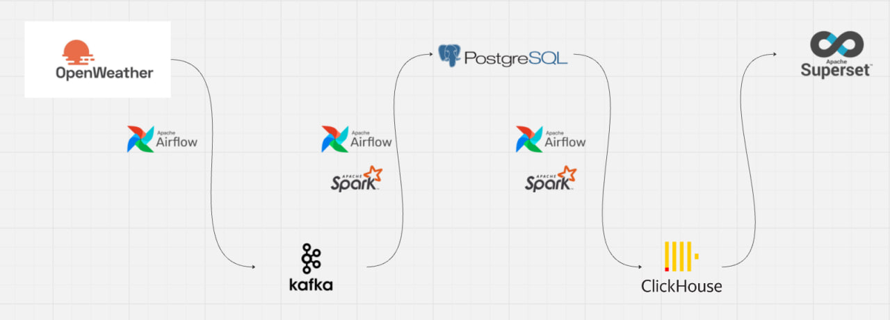

# Weather-Data-Pipeline

Этот пет-проект демонстрирует создание потоково-батчевого конвейера для сбора, обработки и визуализации данных о погоде.  
Основной упор — на интеграцию **Kafka**, **Airflow**, **PySpark**, **PostgreSQL**, **ClickHouse** и **Superset**, полностью работающих в **Docker**.


---

## 🚀 Архитектура проекта

Проект реализует сквозной пайплайн:

1. **PostgreSQL** — хранилище "сырых" данных о погоде.  
   При старте инициализируется схема с таблицей `weather_data`.

2. **ClickHouse** — хранилище витрин.  
   Создаются таблицы для агрегированных данных.

3. **Kafka** — потоковый шину для передачи данных:
   - **producer DAG** генерирует и отправляет погодные события в топик Kafka с помощью Spark Streaming.
   - **consumer DAG** читает события и сохраняет их в PostgreSQL.

4. **PySpark**:
   - Streaming — работает в producer-DAG.
   - Batch — забирает новые данные из PostgreSQL, агрегирует их (например, среднесуточные показатели) и отправляет в ClickHouse.

5. **Airflow** — оркестрация DAG’ов:
   - `init_postgres_dag`  
   - `init_clickhouse_dag`  
   - `producer_api_dag`
   - `consumer_psql_dag`
   - `clickhouse_spark_batch_dag`
   - `master_dag`

6. **Superset** — BI-витрина.  
   На основе данных из ClickHouse строится интерактивный дашборд.

---

## 🧩 Логика работы пайплайна

### 🔹 1. Producer DAG
- Запускается Spark Streaming.
- Собирает данные о погоде из открытого API.
- Преобразует данные в формат сообщений.
- Публикует их в Kafka-топик `weather-topic`.

### 🔹 2. Consumer DAG
- Читает сообщения из Kafka.
- Приводит данные к табличной структуре.
- Загружает строки в PostgreSQL (`weather_data`).

### 🔹 3. Batch DAG
- PySpark-задание выбирает новые записи из PostgreSQL.
- Делает агрегаты (средняя температура по городу за час/сутки, максимальные значения и т.д.).
- Загружает итоговые витрины в ClickHouse.

### 🔹 4. Дашборд
- Через Superset подключается ClickHouse.
- Строятся визуализации:  
  ✔ динамика температуры  
  ✔ сравнение городов  
  ✔ тренды по дням/часам  
  ✔ карта или распределение погодных параметров  

---

## 📦 Docker-композиция

Все сервисы — Airflow, Kafka, Zookeeper, Spark, PostgreSQL, ClickHouse, Superset — запускаются одной командой:

```bash
docker compose up -d
